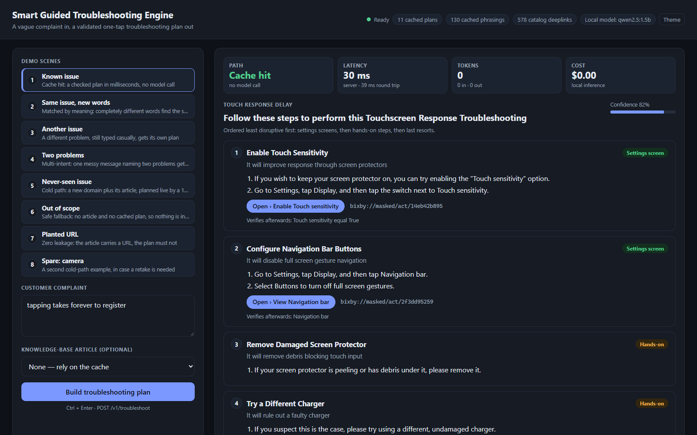
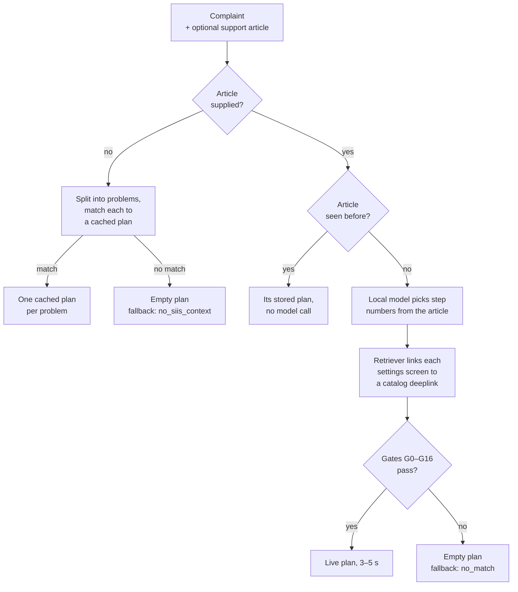

# Smart Guided Troubleshooting Engine

**Samsung PRISM GenAI Hackathon 3.0 · Theme 02**

A Galaxy user describes a problem in their own words, such as *"every tap takes ages
to register"*. The engine answers with a troubleshooting plan: ordered actions built
from the support article's own steps, least disruptive first. Each settings step
carries a deeplink that opens the right Settings screen in one tap.

- **Known problems** come back from a semantic cache in milliseconds, with no model call.
- **New problems** are planned live from the supplied support article by a
  1.5-billion-parameter model running locally, in 3 to 5 seconds.
- **Every response** is schema-valid JSON with no web URLs. Every deeplink in it is
  copied from the provided catalog.



## Submission checklist

| Item | Where |
|---|---|
| Source Code | This repository: [`api/`](api/), [`engine/`](engine/), [`validators/`](validators/), [`scripts/`](scripts/), [`tests/`](tests/); dependencies in [`requirements.txt`](requirements.txt) (exact pins in [`requirements.lock`](requirements.lock)) |
| Presentation | [`presentation/Smart_Guided_Troubleshooting_Engine.pptx`](presentation/Smart_Guided_Troubleshooting_Engine.pptx) · [PDF copy](presentation/Smart_Guided_Troubleshooting_Engine.pdf) |
| Video | Demo video: **link to be added** (YouTube or Drive). Recording runbook: [`docs/DEMO.md`](docs/DEMO.md) |
| AI Disclosure | [`AI_DISCLOSURE.md`](AI_DISCLOSURE.md) |
| README | This file |
| APK/SDK (if any) | Not applicable. The deliverable is a REST API (`POST /v1/troubleshoot`, `GET /health`); there is no APK or SDK. |
| TAG | `PRISM_GENAI_HACKATHON_Y2026` |

## Results

These results were measured on a laptop (Intel i5-13420H, RTX 4050 6 GB) and are
compared with the problem statement's targets. The full report, in the problem
statement's Appendix C format, is [`docs/metrics.md`](docs/metrics.md). The raw
output behind each figure is in [`reports/`](reports/README.md).

| Measure | Target | Measured |
|---|---|---|
| Cache hit, P95 latency | ≤ 300 ms | **0.3 ms** exact phrasing · **28.6 ms** new phrasing |
| Live plan (cold path), P95 latency | ≤ 8 s | **5.2 s** |
| Schema-valid responses | ≥ 99% | **100%**: 325/325 over HTTP, 20/20 batch lines |
| Web-URL leaks | 0 | **0**, including URLs planted in the article or typed into the complaint |
| Deeplinks that exist in the catalog | 100% | **100%**, because no model ever writes one |
| Cache hit rate on unseen phrasings | ≥ 80% | **84.6%** on the tuning set · **100%** on 27 phrasings written afterwards |
| Step accuracy (0–3) | [rubric](docs/RUBRIC.md) | **2.92** cached plans · **2.97** live plans |
| Deeplink relevance (0–2) | [rubric](docs/RUBRIC.md) | **1.78** |
| Cost per query | tracked | **$0.00**, local inference |

## How it works



Complaints about topics no plan covers, such as battery or connectivity, are
recognised as out of scope. They get the `no_siis_context` fallback instead of the
nearest display plan; 37 of 38 did in a held-out test. An article counts as seen
before if it is one of the supplied articles, as sent or reformatted, or if this
server has already planned it. Either way its stored plan comes back with no model
call.

The cached plans come from the same pipeline, run once per supplied article at
build time with a stronger hosted model (Claude Opus 5). Its output is captured in
`build/skeletons.json`, and `scripts/compile_plans.py` turns it into validated plans
in `artifacts/`. The same script also stores embeddings of the plans' 130 cached
phrasings and of the deeplink catalog. No hosted model is called at runtime.

Three rules the design never breaks:

1. **The model never writes user-facing text.** It picks step *numbers* from the
   article, and code copies those steps verbatim. A step that isn't in the source
   can't appear.
2. **The model never sees or writes a deeplink.** It describes the screen it wants,
   and a retriever (BM25 plus dense embeddings) finds the catalog entry. An invented
   URI is impossible.
3. **The cache is the pipeline, frozen.** Cached plans are the pipeline's own output
   from build time, not a separate hand-written answer path.

[`docs/ARCHITECTURE.md`](docs/ARCHITECTURE.md) walks through each stage, and
[`docs/DECISIONS.md`](docs/DECISIONS.md) records the 23 design decisions with their
evidence.

## Quickstart

You need Python 3.12 or later. Live plans also need [Ollama](https://ollama.com)
with the extractor model; the cache path needs no model server.

```bash
python -m venv .venv
source .venv/bin/activate            # Windows: .venv\Scripts\activate
pip install -r requirements.txt
ollama pull qwen2.5:1.5b             # about 1 GB; live path only

python -m pytest tests -q            # regression suite
python -m uvicorn api.main:app --port 8000
```

The first start downloads the `BAAI/bge-small-en-v1.5` encoder from Hugging Face.
After that, the API is ready in about 22 s on the test laptop. For exact versions,
use `requirements.lock`, which pins CPU-only torch:
`pip install --extra-index-url https://download.pytorch.org/whl/cpu -r requirements.lock`.

### Demo

```bash
python scripts/demo.py
```

This command:

1. checks Ollama and starts it if needed
2. loads the model
3. starts the API with the demo page switched on
4. warms every path
5. opens <http://127.0.0.1:8000/demo>

The page has seven scenes: `Alt+1` … `Alt+7` picks one and `Ctrl+Enter` runs it.
The recording runbook is [`docs/DEMO.md`](docs/DEMO.md). The page is only mounted
when `PRISM_DEMO=1`, so the graded API stays exactly the two endpoints below.

### Container

```bash
python scripts/vendor_models.py      # copy the encoder into vendor/ (needs network once)
podman build -t prism-engine .       # or docker
podman run --rm -p 8000:8000 prism-engine
```

The image runs offline. For live plans, set `OLLAMA_HOST` to the URL of an Ollama
server the container can reach. On Linux, `--network host` lets it use the host's
Ollama.

## API

`POST /v1/troubleshoot`

```json
{ "query": "my touch screen is slow to respond" }
```

`siis_response` is an optional support article: a string, or an object with
`title` and `content`. When it is present, the plan is built from that article.
Without one, the answer comes from the cache, or the response is a fallback.

This response was captured from the running demo and trimmed:

```jsonc
{
  "query": "my touch screen is slow to respond",
  "query_variations": ["My Galaxy S22 screen inputs are delayed and touch responsiveness is laggy.", "…"],
  "response": {
    "contexts": [{
      "goal": "Follow these steps to perform this Touchscreen Response Troubleshooting",
      "title": "Touch response delay",
      "score": 0.934,
      "actions": [{
        "actionName": "Enable Touch Sensitivity",
        "category": "auto",
        "description": "It will improve response through screen protectors",
        "stepGroups": [{
          "steps": [
            "If you wish to keep your screen protector on, you can try enabling the \"Touch sensitivity\" option.",
            "Go to Settings, tap Display, and then tap the switch next to Touch sensitivity."
          ],
          "actionableDeeplink": { "deeplink": "bixby://masked/act/14eb42b895", "message": "Enable Touch sensitivity" },
          "validationDeeplink": { "deeplink": "bixby://masked/val/6451858b28", "key": "Touch sensitivity",
                                  "condition": "equal", "value": "True" }
        }]
      }]
      // …5 more actions: another settings screen, two hands-on checks, then Safe mode and a factory reset
    }]
  },
  "meta": { "latency_ms": 36.25, "cache_hit": true, "model": null, "cost_usd": 0.0,
            "fallback": null, "tokens": { "prompt": 0, "completion": 0 } }
}
```

`meta.fallback` takes one of three values:

- `null`: a plan was returned.
- `"no_siis_context"`: no article was sent and no cached plan fits.
- `"no_match"`: no valid plan could be built.

`GET /health` returns the loaded state, or HTTP 503 with the reason if startup
failed:

```json
{ "status": "ok", "plans": 11, "cache_vectors": 130, "catalog_uris": 578,
  "extractor": "qwen2.5:1.5b", "extractor_available": true, "error": null }
```

## Reproducing the numbers

Every figure in `docs/metrics.md` comes from a script, and the raw output lands in
`reports/`:

```bash
python scripts/run_reports.py fixed                                    # tests, gates, accuracy, retrieval, cache
python scripts/run_reports.py models --models qwen2.5:1.5b gemma3:4b   # extractor comparison
python scripts/run_reports.py model --model qwen2.5:1.5b               # latency, results.jsonl, ablation, HTTP stress
```

`artifacts/` is generated only by `scripts/compile_plans.py`, which fails on any
blocking gate. Never hand-edit it; fix the pipeline and rebuild.

## Known limitations

The full list, with evidence, is in
[`docs/metrics.md` §6](docs/metrics.md#6-known-edge-cases--system-limitations).
The main ones:

- **Cached plans cover display problems only**, because every supplied article and
  query is about the display. Battery, camera and performance complaints are
  answered only when a support article is sent with them, through the live path.
- **Live plans rarely link a specific Settings screen.** Only 19% of their settings
  actions do, against 69% in cached plans. The others get the catalog's generic
  placeholder, `bixby://dummy_positive`.
- **A second problem that no plan covers is dropped without notice** when one
  complaint names two problems.
- **A request with a new article always takes the live path** (3–5 s), even
  when its complaint matches a cached plan, because the plan must come from the
  text that was sent.
- **All figures come from one shared Windows laptop**, where latency varies by
  5–10% between runs.

## Repository layout

```
api/                FastAPI app: POST /v1/troubleshoot, GET /health (+ /demo when PRISM_DEMO=1)
engine/             normalize, segment, cold (live path), deeplink, rerank, assemble,
                    cache, articles, variations, embed
validators/         URL scrub (G0) and gates G1–G16
schema.py           response schema from the kit
demo/               demo page and its scene list
scripts/            build, evaluation, benchmark and demo scripts
tests/              regression suite and labelled fixtures
build/              captured build-tier model output; out-of-scope topics
artifacts/          generated: plan library; cache, catalog and out-of-scope vectors
data/               supplied inputs: 11 support articles, 578-entry deeplink catalog, 20 queries
reports/            raw output behind every figure in docs/metrics.md
docs/               design, decisions, metrics, demo runbook
presentation/       the presentation (.pptx and a PDF copy)
AI_DISCLOSURE.md    where AI is used, in the product and in building it
Theme02_Input_Kit/  the Theme 02 input kit, as supplied
participant-kit/    Theme 05's participant kit, kept as a reference for submission conventions
```

## Documentation

| File | Contents |
|---|---|
| [`docs/ARCHITECTURE.md`](docs/ARCHITECTURE.md) | stage-by-stage design, invariants, latency budget |
| [`docs/DATA_CONTRACT.md`](docs/DATA_CONTRACT.md) | field rules, gates G0–G16, catalog hazards |
| [`docs/DECISIONS.md`](docs/DECISIONS.md) | decision records ADR-001 to ADR-023, open questions for the mentor |
| [`docs/metrics.md`](docs/metrics.md) | measured results in the Appendix C format |
| [`docs/PS_ALIGNMENT.md`](docs/PS_ALIGNMENT.md) | requirement-by-requirement audit against the problem statement |
| [`docs/RUBRIC.md`](docs/RUBRIC.md) | how step accuracy and deeplink relevance are scored |
| [`docs/DEMO.md`](docs/DEMO.md) | demo video runbook: setup, scenes, numbers to quote |
| [`docs/TECH_PLAN.md`](docs/TECH_PLAN.md) | stack, repo layout, milestones |

The support articles, deeplink catalog, queries and response schema come from the
hackathon's Theme 02 kit. The battery, camera and performance articles in
`tests/fixtures/probes/` are samples the team wrote to test other domains.
